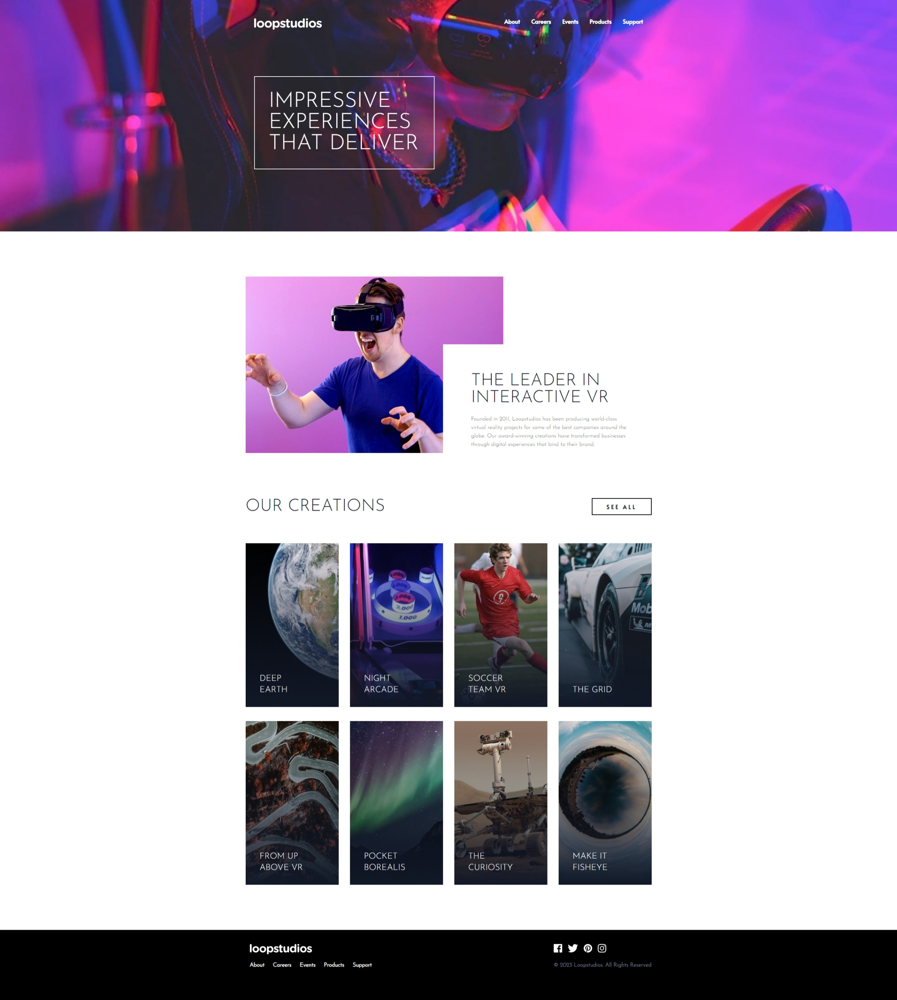

# Frontend Mentor - Loopstudios landing page solution

This is a solution to the [Loopstudios landing page challenge on Frontend Mentor](https://www.frontendmentor.io/challenges/loopstudios-landing-page-N88J5Onjw). Frontend Mentor challenges help you improve your coding skills by building realistic projects.

## Table of contents

- [Overview](#overview)
  - [The challenge](#the-challenge)
  - [Screenshot](#screenshot)
  - [Links](#links)
- [My process](#my-process)
  - [Built with](#built-with)
  - [Useful resources](#useful-resources)
- [Author](#author)

## Overview

### The challenge

Users should be able to:

- View the optimal layout for the site depending on their device's screen size
- See hover states for all interactive elements on the page

### Screenshot

- Solution URL: [https://www.frontendmentor.io/solutions/loopstudios-landing-page-0pilQK1lVn](https://www.frontendmentor.io/solutions/loopstudios-landing-page-0pilQK1lVn)
- Live Site URL: [https://loopstudios-landing-page-theta-pearl.vercel.app/](https://loopstudios-landing-page-theta-pearl.vercel.app/)

## My process

### Built with

- Semantic HTML5 markup
- Tailwind CSS
- Flexbox
- Mobile-first workflow

### Useful resources

- [Tailwind Docs](https://tailwindcss.com/) - The Tailwind CSS documentation is very helpful for me.

## Author

- Frontend Mentor - [@sean-birmingham](https://www.frontendmentor.io/profile/sean-birmingham)
- Twitter - [@THEHYDRA98](https://www.twitter.com/thehydra98)
